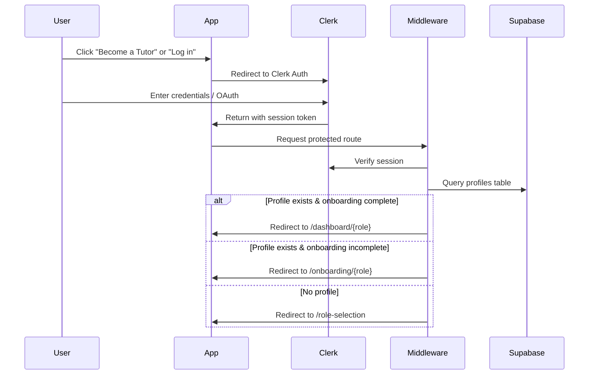
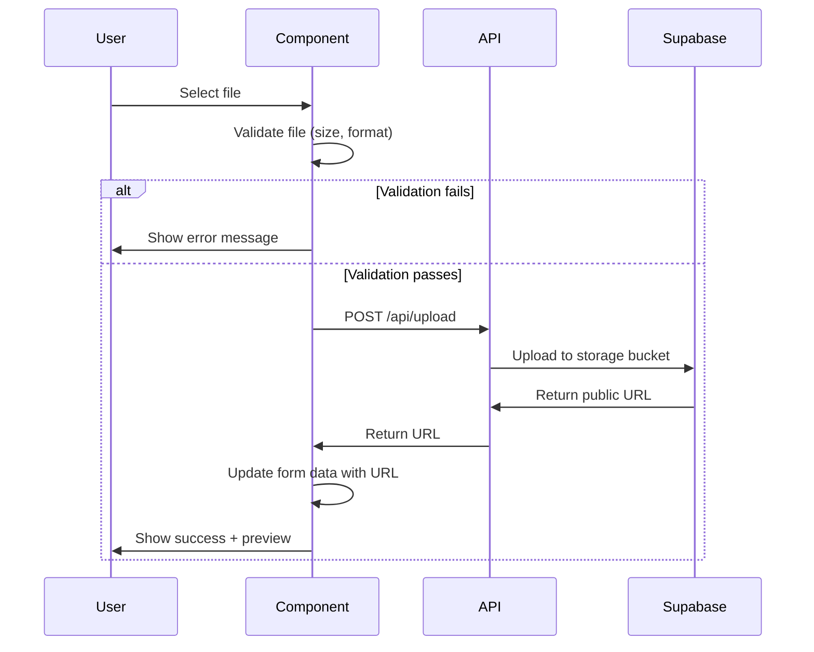

# Design Document: Authentication and Onboarding Flow

## Overview

This design document specifies the technical implementation of a comprehensive authentication and onboarding system for SabiLearn, a tutoring marketplace platform. The system integrates Clerk for authentication, Supabase for data persistence, and Next.js 14+ App Router for the frontend framework.

The authentication and onboarding flow guides users through a one-time setup process where they:
1. Authenticate using Clerk (email/password or Google OAuth)
2. Select their role (Tutor, Student, or Parent)
3. Complete a role-specific onboarding form
4. Get redirected to their role-specific dashboard

Once onboarding is complete, the user's role is permanently locked, and they are automatically routed to their appropriate dashboard on subsequent logins.

### Key Design Principles

- **Single Source of Truth**: Clerk manages authentication state; Supabase stores profile and role data
- **Progressive Enhancement**: Onboarding progress is auto-saved every 30 seconds
- **Role-Based Access Control**: Middleware enforces authorization at the routing layer
- **Immutable Roles**: Once onboarding is complete, roles cannot be changed
- **Graceful Degradation**: Network failures are handled with retry mechanisms

## Architecture

### System Components

```
┌─────────────────────────────────────────────────────────────────┐
│                         Client Layer                             │
│  ┌──────────────┐  ┌──────────────┐  ┌──────────────┐          │
│  │ Role Select  │  │  Onboarding  │  │  Dashboards  │          │
│  │   Screen     │  │    Forms     │  │              │          │
│  └──────────────┘  └──────────────┘  └──────────────┘          │
└─────────────────────────────────────────────────────────────────┘
                              │
                              ▼
┌─────────────────────────────────────────────────────────────────┐
│                      Next.js Middleware                          │
│  ┌──────────────────────────────────────────────────────────┐   │
│  │  • Verify Clerk Session                                  │   │
│  │  • Query Supabase for Profile                            │   │
│  │  • Route based on onboarding_completed + role            │   │
│  └──────────────────────────────────────────────────────────┘   │
└─────────────────────────────────────────────────────────────────┘
                              │
                ┌─────────────┴─────────────┐
                ▼                           ▼
┌─────────────────────┐           ┌─────────────────────┐
│   Clerk Auth API    │           │  Supabase Database  │
│  ┌───────────────┐  │           │  ┌───────────────┐  │
│  │ User Identity │  │           │  │   profiles    │  │
│  │   Sessions    │  │           │  │   tutors      │  │
│  │   OAuth       │  │           │  │   students    │  │
│  └───────────────┘  │           │  │   parents     │  │
└─────────────────────┘           │  └───────────────┘  │
                                  └─────────────────────┘
```

### Technology Stack

- **Frontend**: Next.js 14+ (App Router), React 19, TypeScript
- **Authentication**: Clerk (@clerk/nextjs ^6.37.3)
- **Database**: Supabase (@supabase/supabase-js ^2.98.0)
- **Styling**: Tailwind CSS 4.1, shadcn/ui components
- **File Storage**: Supabase Storage (for profile photos, videos, credentials)
- **Form Management**: React Hook Form + Zod validation
- **State Management**: React Context + SWR for data fetching

### Authentication Flow




## Components and Interfaces

### 1. Role Selection Component

**Location**: `app/role-selection/page.tsx`

**Purpose**: First-time user interface for selecting Tutor, Student, or Parent role

**Component Structure**:
```typescript
interface RoleSelectionProps {
  userId: string; // Clerk user ID
}

interface RoleCard {
  role: 'tutor' | 'student' | 'parent';
  icon: string;
  title: string;
  description: string;
}

const roleCards: RoleCard[] = [
  {
    role: 'tutor',
    icon: '🧑‍🏫',
    title: 'Tutor',
    description: 'Share your knowledge and earn by teaching students'
  },
  {
    role: 'student',
    icon: '🎓',
    title: 'Student',
    description: 'Find expert tutors to help you excel in your studies'
  },
  {
    role: 'parent',
    icon: '👨‍👩‍👧',
    title: 'Parent',
    description: 'Find qualified tutors for your child\'s education'
  }
];
```

**State Management**:
- `selectedRole`: string | null - Currently selected role
- `isSubmitting`: boolean - Loading state during profile creation

**User Interactions**:
- Hover: Apply border highlight and scale transform
- Click: Toggle selection state with background color change
- Continue button: Disabled until role selected, creates profile record on click


### 2. Onboarding Form Components

#### Tutor Onboarding Form

**Location**: `app/onboarding/tutor/page.tsx`

**Form Fields**:
```typescript
interface TutorOnboardingData {
  // Personal Information
  name: string;
  email: string;
  phone: string;
  bio: string;
  
  // Professional Details
  subjects: string[]; // Multi-select: Math, English, Physics, etc.
  experienceLevel: 'beginner' | 'intermediate' | 'expert';
  gradeLevels: string[]; // Multi-select: Primary 1-6, JSS 1-3, SSS 1-3
  hourlyRate: number;
  
  // Media Uploads
  profilePhoto: File | null;
  introVideo: File | null;
  credentials: File[]; // Multiple file upload
  
  // Payment & Availability
  bankDetails: {
    bankName: string;
    accountNumber: string;
    accountName: string;
  };
  availability: {
    [day: string]: { start: string; end: string }[];
  };
  location: string;
}
```

**Validation Rules**:
- name: Required, min 2 characters
- email: Required, valid email format
- phone: Required, Nigerian phone format (+234...)
- bio: Required, min 50 characters, max 500 characters
- subjects: Required, at least 1 selected
- experienceLevel: Required
- gradeLevels: Required, at least 1 selected
- hourlyRate: Required, min ₦500, max ₦50,000
- profilePhoto: Required, JPEG/PNG, max 10MB
- introVideo: Optional, MP4, max 50MB
- credentials: Required, at least 1 PDF, max 5MB each
- bankDetails: All fields required
- availability: At least 1 time slot required


#### Student Onboarding Form

**Location**: `app/onboarding/student/page.tsx`

**Form Fields**:
```typescript
interface StudentOnboardingData {
  // Personal Information
  name: string;
  email: string;
  phone: string;
  gradeLevel: string; // Single select: Primary 1-6, JSS 1-3, SSS 1-3
  
  // Learning Preferences
  subjectsNeeded: string[]; // Multi-select
  learningGoals: string; // Text area
  preferredMode: 'online' | 'home' | 'both';
  
  // Parent Information (if minor)
  isMinor: boolean;
  parentName?: string;
  parentEmail?: string;
  parentPhone?: string;
  
  // Optional
  profilePhoto?: File;
}
```

**Validation Rules**:
- name: Required, min 2 characters
- email: Required, valid email format
- phone: Required, Nigerian phone format
- gradeLevel: Required
- subjectsNeeded: Required, at least 1 selected
- learningGoals: Required, min 20 characters
- preferredMode: Required
- If isMinor is true: parentName, parentEmail, parentPhone all required
- profilePhoto: Optional, JPEG/PNG, max 10MB


#### Parent Onboarding Form

**Location**: `app/onboarding/parent/page.tsx`

**Form Fields**:
```typescript
interface ParentOnboardingData {
  // Parent Information
  name: string;
  email: string;
  phone: string;
  
  // Child Information
  childName: string;
  childGradeLevel: string;
  subjectsNeeded: string[];
  
  // Preferences
  preferredSchedule: string; // Text description
  location: string; // For home tutoring
  preferredMode: 'online' | 'home' | 'both';
  
  // Optional
  profilePhoto?: File;
}
```

**Validation Rules**:
- name: Required, min 2 characters
- email: Required, valid email format
- phone: Required, Nigerian phone format
- childName: Required, min 2 characters
- childGradeLevel: Required
- subjectsNeeded: Required, at least 1 selected
- preferredSchedule: Required, min 10 characters
- location: Required if preferredMode includes 'home'
- profilePhoto: Optional, JPEG/PNG, max 10MB


### 3. Progress Indicator Component

**Location**: `components/onboarding/ProgressIndicator.tsx`

**Purpose**: Visual feedback showing onboarding completion percentage

```typescript
interface ProgressIndicatorProps {
  currentStep: number;
  totalSteps: number;
  completedFields: number;
  totalFields: number;
}

// Calculation: (completedFields / totalFields) * 100
```

**Visual Design**:
- Horizontal progress bar at top of onboarding form
- Percentage text display
- Step indicators (1/5, 2/5, etc.)
- Smooth animation on progress updates

### 4. Dashboard Components

**Locations**:
- `app/dashboard/tutor/page.tsx`
- `app/dashboard/student/page.tsx`
- `app/dashboard/parent/page.tsx`

**Common Dashboard Features**:
- Welcome message with user name
- Profile completion status
- Quick action buttons
- Recent activity feed
- Navigation sidebar

**Role-Specific Features**:

**Tutor Dashboard**:
- Upcoming sessions calendar
- Earnings summary
- Student requests
- Profile views analytics

**Student Dashboard**:
- Recommended tutors
- Upcoming sessions
- Learning progress tracker
- Saved tutors

**Parent Dashboard**:
- Child's upcoming sessions
- Tutor recommendations
- Payment history
- Progress reports


## Data Models

### Database Schema

#### 1. Profiles Table

**Purpose**: Central table linking Clerk users to their role and onboarding status

```sql
CREATE TABLE profiles (
  id UUID PRIMARY KEY DEFAULT uuid_generate_v4(),
  clerk_user_id TEXT UNIQUE NOT NULL,
  role TEXT NOT NULL CHECK (role IN ('tutor', 'student', 'parent')),
  onboarding_completed BOOLEAN DEFAULT FALSE,
  created_at TIMESTAMP WITH TIME ZONE DEFAULT NOW(),
  updated_at TIMESTAMP WITH TIME ZONE DEFAULT NOW()
);

CREATE INDEX idx_profiles_clerk_user_id ON profiles(clerk_user_id);
CREATE INDEX idx_profiles_role ON profiles(role);
```

**Row Level Security**:
```sql
-- Users can read their own profile
CREATE POLICY "Users can view own profile" ON profiles
  FOR SELECT USING (auth.uid()::text = clerk_user_id);

-- Users can update their own profile only if onboarding not complete
CREATE POLICY "Users can update own incomplete profile" ON profiles
  FOR UPDATE USING (
    auth.uid()::text = clerk_user_id AND 
    onboarding_completed = FALSE
  );

-- Prevent role changes after onboarding completion
CREATE POLICY "Prevent role change after completion" ON profiles
  FOR UPDATE USING (
    auth.uid()::text = clerk_user_id AND 
    (onboarding_completed = FALSE OR role = OLD.role)
  );
```


#### 2. Tutors Table (Extended)

**Purpose**: Store tutor-specific profile and professional information

```sql
CREATE TABLE tutors (
  id UUID PRIMARY KEY DEFAULT uuid_generate_v4(),
  clerk_user_id TEXT UNIQUE NOT NULL REFERENCES profiles(clerk_user_id),
  name TEXT NOT NULL,
  email TEXT UNIQUE NOT NULL,
  phone TEXT NOT NULL,
  avatar_url TEXT,
  bio TEXT NOT NULL,
  
  -- Professional Details
  subjects JSONB DEFAULT '[]'::jsonb NOT NULL,
  experience_level TEXT NOT NULL CHECK (experience_level IN ('beginner', 'intermediate', 'expert')),
  grade_levels JSONB DEFAULT '[]'::jsonb NOT NULL,
  hourly_rate DECIMAL(10, 2) NOT NULL,
  
  -- Media
  intro_video_url TEXT,
  credentials_urls JSONB DEFAULT '[]'::jsonb,
  
  -- Payment
  bank_name TEXT NOT NULL,
  account_number TEXT NOT NULL,
  account_name TEXT NOT NULL,
  
  -- Availability
  availability JSONB DEFAULT '{}'::jsonb,
  location TEXT NOT NULL,
  
  -- Platform Metadata
  rating DECIMAL(3, 2) DEFAULT 0,
  total_reviews INTEGER DEFAULT 0,
  is_verified BOOLEAN DEFAULT FALSE,
  is_available BOOLEAN DEFAULT TRUE,
  
  created_at TIMESTAMP WITH TIME ZONE DEFAULT NOW(),
  updated_at TIMESTAMP WITH TIME ZONE DEFAULT NOW()
);

CREATE INDEX idx_tutors_clerk_user_id ON tutors(clerk_user_id);
CREATE INDEX idx_tutors_subjects ON tutors USING GIN (subjects);
CREATE INDEX idx_tutors_grade_levels ON tutors USING GIN (grade_levels);
```

**JSONB Structure Examples**:
```json
// subjects
["Mathematics", "Physics", "Chemistry"]

// grade_levels
["JSS 1", "JSS 2", "JSS 3", "SSS 1"]

// availability
{
  "monday": [{"start": "09:00", "end": "12:00"}, {"start": "14:00", "end": "17:00"}],
  "tuesday": [{"start": "09:00", "end": "17:00"}],
  "wednesday": []
}

// credentials_urls
["https://storage.supabase.co/tutors/credentials/abc123.pdf"]
```


#### 3. Students Table (Extended)

**Purpose**: Store student-specific profile and learning preferences

```sql
CREATE TABLE students (
  id UUID PRIMARY KEY DEFAULT uuid_generate_v4(),
  clerk_user_id TEXT UNIQUE NOT NULL REFERENCES profiles(clerk_user_id),
  name TEXT NOT NULL,
  email TEXT UNIQUE NOT NULL,
  phone TEXT NOT NULL,
  avatar_url TEXT,
  
  -- Academic Information
  grade_level TEXT NOT NULL,
  subjects_needed JSONB DEFAULT '[]'::jsonb NOT NULL,
  learning_goals TEXT NOT NULL,
  preferred_mode TEXT NOT NULL CHECK (preferred_mode IN ('online', 'home', 'both')),
  
  -- Parent Information (for minors)
  is_minor BOOLEAN DEFAULT FALSE,
  parent_name TEXT,
  parent_email TEXT,
  parent_phone TEXT,
  
  created_at TIMESTAMP WITH TIME ZONE DEFAULT NOW(),
  updated_at TIMESTAMP WITH TIME ZONE DEFAULT NOW(),
  
  -- Conditional constraint: if is_minor, parent info required
  CONSTRAINT parent_info_required CHECK (
    NOT is_minor OR (
      parent_name IS NOT NULL AND 
      parent_email IS NOT NULL AND 
      parent_phone IS NOT NULL
    )
  )
);

CREATE INDEX idx_students_clerk_user_id ON students(clerk_user_id);
CREATE INDEX idx_students_grade_level ON students(grade_level);
CREATE INDEX idx_students_subjects_needed ON students USING GIN (subjects_needed);
```


#### 4. Parents Table

**Purpose**: Store parent-specific profile and child information

```sql
CREATE TABLE parents (
  id UUID PRIMARY KEY DEFAULT uuid_generate_v4(),
  clerk_user_id TEXT UNIQUE NOT NULL REFERENCES profiles(clerk_user_id),
  name TEXT NOT NULL,
  email TEXT UNIQUE NOT NULL,
  phone TEXT NOT NULL,
  avatar_url TEXT,
  
  -- Child Information
  child_name TEXT NOT NULL,
  child_grade_level TEXT NOT NULL,
  subjects_needed JSONB DEFAULT '[]'::jsonb NOT NULL,
  
  -- Preferences
  preferred_schedule TEXT NOT NULL,
  location TEXT NOT NULL,
  preferred_mode TEXT NOT NULL CHECK (preferred_mode IN ('online', 'home', 'both')),
  
  created_at TIMESTAMP WITH TIME ZONE DEFAULT NOW(),
  updated_at TIMESTAMP WITH TIME ZONE DEFAULT NOW()
);

CREATE INDEX idx_parents_clerk_user_id ON parents(clerk_user_id);
CREATE INDEX idx_parents_child_grade_level ON parents(child_grade_level);
CREATE INDEX idx_parents_subjects_needed ON parents USING GIN (subjects_needed);
```


#### 5. Onboarding Progress Table

**Purpose**: Store partial onboarding data for resumption

```sql
CREATE TABLE onboarding_progress (
  id UUID PRIMARY KEY DEFAULT uuid_generate_v4(),
  clerk_user_id TEXT UNIQUE NOT NULL,
  role TEXT NOT NULL CHECK (role IN ('tutor', 'student', 'parent')),
  form_data JSONB DEFAULT '{}'::jsonb,
  last_saved_at TIMESTAMP WITH TIME ZONE DEFAULT NOW(),
  created_at TIMESTAMP WITH TIME ZONE DEFAULT NOW()
);

CREATE INDEX idx_onboarding_progress_clerk_user_id ON onboarding_progress(clerk_user_id);

-- Auto-delete progress after onboarding completion
CREATE OR REPLACE FUNCTION delete_onboarding_progress()
RETURNS TRIGGER AS $$
BEGIN
  IF NEW.onboarding_completed = TRUE THEN
    DELETE FROM onboarding_progress WHERE clerk_user_id = NEW.clerk_user_id;
  END IF;
  RETURN NEW;
END;
$$ LANGUAGE plpgsql;

CREATE TRIGGER cleanup_onboarding_progress
AFTER UPDATE ON profiles
FOR EACH ROW
EXECUTE FUNCTION delete_onboarding_progress();
```

**JSONB form_data structure** (example for tutor):
```json
{
  "name": "John Doe",
  "email": "john@example.com",
  "phone": "+2348012345678",
  "bio": "Experienced mathematics teacher...",
  "subjects": ["Mathematics", "Physics"],
  "experienceLevel": "expert",
  "gradeLevels": ["SSS 1", "SSS 2"],
  "hourlyRate": 5000,
  "profilePhotoUploaded": true,
  "credentialsUploaded": false,
  "bankDetails": {
    "bankName": "GTBank",
    "accountNumber": "0123456789"
  }
}
```


## Routing Strategy

### Next.js App Router Structure

```
app/
├── layout.tsx                    # Root layout with Clerk provider
├── page.tsx                      # Landing page
├── middleware.ts                 # Auth & routing middleware
│
├── sign-in/
│   └── [[...sign-in]]/
│       └── page.tsx             # Clerk sign-in page
│
├── sign-up/
│   └── [[...sign-up]]/
│       └── page.tsx             # Clerk sign-up page
│
├── role-selection/
│   └── page.tsx                 # Role selection screen
│
├── onboarding/
│   ├── tutor/
│   │   └── page.tsx            # Tutor onboarding form
│   ├── student/
│   │   └── page.tsx            # Student onboarding form
│   └── parent/
│       └── page.tsx            # Parent onboarding form
│
└── dashboard/
    ├── tutor/
    │   └── page.tsx            # Tutor dashboard
    ├── student/
    │   └── page.tsx            # Student dashboard
    └── parent/
        └── page.tsx            # Parent dashboard
```

### Middleware Routing Logic

**Location**: `middleware.ts`

```typescript
import { authMiddleware } from '@clerk/nextjs';
import { NextResponse } from 'next/server';
import type { NextRequest } from 'next/server';

export default authMiddleware({
  publicRoutes: ['/', '/sign-in(.*)', '/sign-up(.*)'],
  
  async afterAuth(auth, req: NextRequest) {
    // Not authenticated - redirect to sign-in
    if (!auth.userId && !isPublicRoute(req)) {
      return NextResponse.redirect(new URL('/sign-in', req.url));
    }
    
    // Authenticated - check profile status
    if (auth.userId) {
      const profile = await getProfile(auth.userId);
      
      // No profile - redirect to role selection
      if (!profile) {
        if (!req.nextUrl.pathname.startsWith('/role-selection')) {
          return NextResponse.redirect(new URL('/role-selection', req.url));
        }
        return NextResponse.next();
      }
      
      // Profile exists but onboarding incomplete
      if (!profile.onboarding_completed) {
        const onboardingPath = `/onboarding/${profile.role}`;
        if (!req.nextUrl.pathname.startsWith(onboardingPath)) {
          return NextResponse.redirect(new URL(onboardingPath, req.url));
        }
        return NextResponse.next();
      }
      
      // Onboarding complete - enforce role-based routing
      const dashboardPath = `/dashboard/${profile.role}`;
      
      // Prevent access to wrong dashboard
      if (req.nextUrl.pathname.startsWith('/dashboard/')) {
        if (!req.nextUrl.pathname.startsWith(dashboardPath)) {
          return NextResponse.redirect(new URL(dashboardPath, req.url));
        }
      }
      
      // Prevent access to role selection or onboarding
      if (
        req.nextUrl.pathname.startsWith('/role-selection') ||
        req.nextUrl.pathname.startsWith('/onboarding/')
      ) {
        return NextResponse.redirect(new URL(dashboardPath, req.url));
      }
    }
    
    return NextResponse.next();
  }
});

export const config = {
  matcher: ['/((?!.+\\.[\\w]+$|_next).*)', '/', '/(api|trpc)(.*)'],
};
```


## State Management

### 1. Profile State Context

**Location**: `contexts/ProfileContext.tsx`

```typescript
interface ProfileContextType {
  profile: Profile | null;
  loading: boolean;
  error: Error | null;
  refetch: () => Promise<void>;
}

const ProfileContext = createContext<ProfileContextType | undefined>(undefined);

export function ProfileProvider({ children }: { children: React.ReactNode }) {
  const { userId } = useAuth();
  const { data, error, mutate } = useSWR(
    userId ? `/api/profile/${userId}` : null,
    fetcher
  );
  
  return (
    <ProfileContext.Provider value={{
      profile: data,
      loading: !data && !error,
      error,
      refetch: mutate
    }}>
      {children}
    </ProfileContext.Provider>
  );
}
```

### 2. Onboarding Form State

**Location**: `hooks/useOnboardingForm.ts`

```typescript
interface UseOnboardingFormOptions<T> {
  role: 'tutor' | 'student' | 'parent';
  initialData?: Partial<T>;
  onSubmit: (data: T) => Promise<void>;
}

function useOnboardingForm<T>({ role, initialData, onSubmit }: UseOnboardingFormOptions<T>) {
  const [formData, setFormData] = useState<Partial<T>>(initialData || {});
  const [isSaving, setIsSaving] = useState(false);
  const [lastSaved, setLastSaved] = useState<Date | null>(null);
  
  // Auto-save every 30 seconds
  useEffect(() => {
    const interval = setInterval(async () => {
      await saveProgress(formData);
      setLastSaved(new Date());
    }, 30000);
    
    return () => clearInterval(interval);
  }, [formData]);
  
  // Load saved progress on mount
  useEffect(() => {
    loadProgress().then(data => {
      if (data) setFormData(data);
    });
  }, []);
  
  const handleSubmit = async () => {
    setIsSaving(true);
    try {
      await onSubmit(formData as T);
      await clearProgress();
    } finally {
      setIsSaving(false);
    }
  };
  
  return {
    formData,
    setFormData,
    isSaving,
    lastSaved,
    handleSubmit
  };
}
```


### 3. File Upload State

**Location**: `hooks/useFileUpload.ts`

```typescript
interface UseFileUploadOptions {
  bucket: string;
  maxSize: number;
  acceptedFormats: string[];
  onUploadComplete?: (url: string) => void;
}

function useFileUpload({ bucket, maxSize, acceptedFormats, onUploadComplete }: UseFileUploadOptions) {
  const [file, setFile] = useState<File | null>(null);
  const [uploading, setUploading] = useState(false);
  const [progress, setProgress] = useState(0);
  const [url, setUrl] = useState<string | null>(null);
  const [error, setError] = useState<string | null>(null);
  
  const upload = async (selectedFile: File) => {
    // Validate file
    if (!acceptedFormats.includes(selectedFile.type)) {
      setError(`Invalid format. Accepted: ${acceptedFormats.join(', ')}`);
      return;
    }
    
    if (selectedFile.size > maxSize) {
      setError(`File too large. Max size: ${maxSize / 1024 / 1024}MB`);
      return;
    }
    
    setFile(selectedFile);
    setUploading(true);
    setError(null);
    
    try {
      const uploadedUrl = await uploadToSupabase(bucket, selectedFile, setProgress);
      setUrl(uploadedUrl);
      onUploadComplete?.(uploadedUrl);
    } catch (err) {
      setError(err.message);
    } finally {
      setUploading(false);
    }
  };
  
  return { file, uploading, progress, url, error, upload };
}
```


## API Routes

### 1. Profile Management

#### Create Profile
**Endpoint**: `POST /api/profile`

**Request Body**:
```typescript
{
  clerkUserId: string;
  role: 'tutor' | 'student' | 'parent';
}
```

**Response**:
```typescript
{
  id: string;
  clerkUserId: string;
  role: string;
  onboardingCompleted: boolean;
  createdAt: string;
}
```

**Implementation**:
```typescript
// app/api/profile/route.ts
export async function POST(req: Request) {
  const { userId } = auth();
  if (!userId) return new Response('Unauthorized', { status: 401 });
  
  const { clerkUserId, role } = await req.json();
  
  // Verify user owns this profile
  if (userId !== clerkUserId) {
    return new Response('Forbidden', { status: 403 });
  }
  
  // Check for existing profile
  const existing = await supabase
    .from('profiles')
    .select('*')
    .eq('clerk_user_id', clerkUserId)
    .single();
  
  if (existing.data) {
    return Response.json(existing.data);
  }
  
  // Create new profile
  const { data, error } = await supabase
    .from('profiles')
    .insert({
      clerk_user_id: clerkUserId,
      role,
      onboarding_completed: false
    })
    .select()
    .single();
  
  if (error) {
    return new Response(error.message, { status: 500 });
  }
  
  return Response.json(data);
}
```


#### Get Profile
**Endpoint**: `GET /api/profile/[userId]`

**Response**:
```typescript
{
  id: string;
  clerkUserId: string;
  role: 'tutor' | 'student' | 'parent';
  onboardingCompleted: boolean;
  createdAt: string;
  updatedAt: string;
}
```

#### Update Profile Role (Only if onboarding incomplete)
**Endpoint**: `PATCH /api/profile/[userId]`

**Request Body**:
```typescript
{
  role: 'tutor' | 'student' | 'parent';
}
```

**Validation**: Only allowed if `onboarding_completed = false`


### 2. Onboarding Completion

#### Complete Tutor Onboarding
**Endpoint**: `POST /api/onboarding/tutor`

**Request Body**:
```typescript
{
  clerkUserId: string;
  name: string;
  email: string;
  phone: string;
  bio: string;
  subjects: string[];
  experienceLevel: string;
  gradeLevels: string[];
  hourlyRate: number;
  profilePhotoUrl: string;
  introVideoUrl?: string;
  credentialsUrls: string[];
  bankName: string;
  accountNumber: string;
  accountName: string;
  availability: object;
  location: string;
}
```

**Implementation**:
```typescript
export async function POST(req: Request) {
  const { userId } = auth();
  if (!userId) return new Response('Unauthorized', { status: 401 });
  
  const data = await req.json();
  
  // Validate all required fields
  const validation = tutorSchema.safeParse(data);
  if (!validation.success) {
    return Response.json({ errors: validation.error.errors }, { status: 400 });
  }
  
  // Insert into tutors table
  const { error: tutorError } = await supabase
    .from('tutors')
    .insert({
      clerk_user_id: userId,
      ...data
    });
  
  if (tutorError) {
    return new Response(tutorError.message, { status: 500 });
  }
  
  // Update profile to mark onboarding complete
  const { error: profileError } = await supabase
    .from('profiles')
    .update({ onboarding_completed: true })
    .eq('clerk_user_id', userId);
  
  if (profileError) {
    return new Response(profileError.message, { status: 500 });
  }
  
  return Response.json({ success: true });
}
```


#### Complete Student Onboarding
**Endpoint**: `POST /api/onboarding/student`

**Request Body**:
```typescript
{
  clerkUserId: string;
  name: string;
  email: string;
  phone: string;
  gradeLevel: string;
  subjectsNeeded: string[];
  learningGoals: string;
  preferredMode: string;
  isMinor: boolean;
  parentName?: string;
  parentEmail?: string;
  parentPhone?: string;
  profilePhotoUrl?: string;
}
```

#### Complete Parent Onboarding
**Endpoint**: `POST /api/onboarding/parent`

**Request Body**:
```typescript
{
  clerkUserId: string;
  name: string;
  email: string;
  phone: string;
  childName: string;
  childGradeLevel: string;
  subjectsNeeded: string[];
  preferredSchedule: string;
  location: string;
  preferredMode: string;
  profilePhotoUrl?: string;
}
```


### 3. Onboarding Progress

#### Save Progress
**Endpoint**: `POST /api/onboarding/progress`

**Request Body**:
```typescript
{
  clerkUserId: string;
  role: string;
  formData: object;
}
```

**Implementation**:
```typescript
export async function POST(req: Request) {
  const { userId } = auth();
  if (!userId) return new Response('Unauthorized', { status: 401 });
  
  const { clerkUserId, role, formData } = await req.json();
  
  if (userId !== clerkUserId) {
    return new Response('Forbidden', { status: 403 });
  }
  
  // Upsert progress
  const { error } = await supabase
    .from('onboarding_progress')
    .upsert({
      clerk_user_id: clerkUserId,
      role,
      form_data: formData,
      last_saved_at: new Date().toISOString()
    }, {
      onConflict: 'clerk_user_id'
    });
  
  if (error) {
    return new Response(error.message, { status: 500 });
  }
  
  return Response.json({ success: true });
}
```

#### Load Progress
**Endpoint**: `GET /api/onboarding/progress/[userId]`

**Response**:
```typescript
{
  clerkUserId: string;
  role: string;
  formData: object;
  lastSavedAt: string;
}
```


### 4. File Upload

#### Upload File to Supabase Storage
**Endpoint**: `POST /api/upload`

**Request**: `multipart/form-data`
```typescript
{
  file: File;
  bucket: 'avatars' | 'videos' | 'credentials';
  userId: string;
}
```

**Response**:
```typescript
{
  url: string;
  path: string;
}
```

**Implementation**:
```typescript
export async function POST(req: Request) {
  const { userId } = auth();
  if (!userId) return new Response('Unauthorized', { status: 401 });
  
  const formData = await req.formData();
  const file = formData.get('file') as File;
  const bucket = formData.get('bucket') as string;
  
  // Validate file size and type
  const validation = validateFile(file, bucket);
  if (!validation.valid) {
    return Response.json({ error: validation.error }, { status: 400 });
  }
  
  // Generate unique filename
  const ext = file.name.split('.').pop();
  const filename = `${userId}/${Date.now()}.${ext}`;
  
  // Upload to Supabase Storage
  const { data, error } = await supabase.storage
    .from(bucket)
    .upload(filename, file, {
      cacheControl: '3600',
      upsert: false
    });
  
  if (error) {
    return new Response(error.message, { status: 500 });
  }
  
  // Get public URL
  const { data: { publicUrl } } = supabase.storage
    .from(bucket)
    .getPublicUrl(filename);
  
  return Response.json({ url: publicUrl, path: filename });
}
```


## Form Validation

### Validation Strategy

**Client-Side**: React Hook Form + Zod schemas for immediate feedback
**Server-Side**: Zod schemas for security and data integrity

### Zod Schemas

#### Tutor Validation Schema

```typescript
import { z } from 'zod';

const tutorSchema = z.object({
  clerkUserId: z.string(),
  name: z.string().min(2, 'Name must be at least 2 characters'),
  email: z.string().email('Invalid email address'),
  phone: z.string().regex(/^\+234\d{10}$/, 'Invalid Nigerian phone number'),
  bio: z.string()
    .min(50, 'Bio must be at least 50 characters')
    .max(500, 'Bio must not exceed 500 characters'),
  subjects: z.array(z.string()).min(1, 'Select at least one subject'),
  experienceLevel: z.enum(['beginner', 'intermediate', 'expert']),
  gradeLevels: z.array(z.string()).min(1, 'Select at least one grade level'),
  hourlyRate: z.number()
    .min(500, 'Minimum rate is ₦500')
    .max(50000, 'Maximum rate is ₦50,000'),
  profilePhotoUrl: z.string().url('Invalid photo URL'),
  introVideoUrl: z.string().url('Invalid video URL').optional(),
  credentialsUrls: z.array(z.string().url()).min(1, 'Upload at least one credential'),
  bankName: z.string().min(1, 'Bank name is required'),
  accountNumber: z.string().regex(/^\d{10}$/, 'Account number must be 10 digits'),
  accountName: z.string().min(1, 'Account name is required'),
  availability: z.record(z.array(z.object({
    start: z.string(),
    end: z.string()
  }))),
  location: z.string().min(1, 'Location is required')
});
```


#### Student Validation Schema

```typescript
const studentSchema = z.object({
  clerkUserId: z.string(),
  name: z.string().min(2, 'Name must be at least 2 characters'),
  email: z.string().email('Invalid email address'),
  phone: z.string().regex(/^\+234\d{10}$/, 'Invalid Nigerian phone number'),
  gradeLevel: z.string().min(1, 'Grade level is required'),
  subjectsNeeded: z.array(z.string()).min(1, 'Select at least one subject'),
  learningGoals: z.string().min(20, 'Learning goals must be at least 20 characters'),
  preferredMode: z.enum(['online', 'home', 'both']),
  isMinor: z.boolean(),
  parentName: z.string().optional(),
  parentEmail: z.string().email().optional(),
  parentPhone: z.string().regex(/^\+234\d{10}$/).optional(),
  profilePhotoUrl: z.string().url().optional()
}).refine(
  (data) => {
    if (data.isMinor) {
      return data.parentName && data.parentEmail && data.parentPhone;
    }
    return true;
  },
  {
    message: 'Parent information is required for minors',
    path: ['parentName']
  }
);
```

#### Parent Validation Schema

```typescript
const parentSchema = z.object({
  clerkUserId: z.string(),
  name: z.string().min(2, 'Name must be at least 2 characters'),
  email: z.string().email('Invalid email address'),
  phone: z.string().regex(/^\+234\d{10}$/, 'Invalid Nigerian phone number'),
  childName: z.string().min(2, 'Child name must be at least 2 characters'),
  childGradeLevel: z.string().min(1, 'Grade level is required'),
  subjectsNeeded: z.array(z.string()).min(1, 'Select at least one subject'),
  preferredSchedule: z.string().min(10, 'Preferred schedule must be at least 10 characters'),
  location: z.string().min(1, 'Location is required'),
  preferredMode: z.enum(['online', 'home', 'both']),
  profilePhotoUrl: z.string().url().optional()
});
```


### File Validation

```typescript
interface FileValidationRules {
  maxSize: number; // in bytes
  acceptedFormats: string[];
}

const fileValidationRules: Record<string, FileValidationRules> = {
  avatars: {
    maxSize: 10 * 1024 * 1024, // 10MB
    acceptedFormats: ['image/jpeg', 'image/png']
  },
  videos: {
    maxSize: 50 * 1024 * 1024, // 50MB
    acceptedFormats: ['video/mp4']
  },
  credentials: {
    maxSize: 5 * 1024 * 1024, // 5MB
    acceptedFormats: ['application/pdf']
  }
};

function validateFile(file: File, bucket: string): { valid: boolean; error?: string } {
  const rules = fileValidationRules[bucket];
  
  if (!rules.acceptedFormats.includes(file.type)) {
    return {
      valid: false,
      error: `Invalid file type. Accepted: ${rules.acceptedFormats.join(', ')}`
    };
  }
  
  if (file.size > rules.maxSize) {
    return {
      valid: false,
      error: `File too large. Max size: ${rules.maxSize / 1024 / 1024}MB`
    };
  }
  
  return { valid: true };
}
```


## File Upload Strategy

### Supabase Storage Buckets

```sql
-- Create storage buckets
INSERT INTO storage.buckets (id, name, public) VALUES
  ('avatars', 'avatars', true),
  ('videos', 'videos', true),
  ('credentials', 'credentials', false);

-- RLS policies for avatars bucket
CREATE POLICY "Users can upload own avatar" ON storage.objects
  FOR INSERT WITH CHECK (
    bucket_id = 'avatars' AND
    auth.uid()::text = (storage.foldername(name))[1]
  );

CREATE POLICY "Avatars are publicly accessible" ON storage.objects
  FOR SELECT USING (bucket_id = 'avatars');

-- RLS policies for videos bucket
CREATE POLICY "Users can upload own video" ON storage.objects
  FOR INSERT WITH CHECK (
    bucket_id = 'videos' AND
    auth.uid()::text = (storage.foldername(name))[1]
  );

CREATE POLICY "Videos are publicly accessible" ON storage.objects
  FOR SELECT USING (bucket_id = 'videos');

-- RLS policies for credentials bucket (private)
CREATE POLICY "Users can upload own credentials" ON storage.objects
  FOR INSERT WITH CHECK (
    bucket_id = 'credentials' AND
    auth.uid()::text = (storage.foldername(name))[1]
  );

CREATE POLICY "Users can view own credentials" ON storage.objects
  FOR SELECT USING (
    bucket_id = 'credentials' AND
    auth.uid()::text = (storage.foldername(name))[1]
  );
```


### Upload Flow



### File Organization Structure

```
Storage Buckets:
├── avatars/
│   └── {clerk_user_id}/
│       └── {timestamp}.{ext}
│
├── videos/
│   └── {clerk_user_id}/
│       └── {timestamp}.mp4
│
└── credentials/
    └── {clerk_user_id}/
        ├── {timestamp}_1.pdf
        ├── {timestamp}_2.pdf
        └── ...
```

### Upload Progress Tracking

```typescript
async function uploadWithProgress(
  file: File,
  bucket: string,
  onProgress: (progress: number) => void
): Promise<string> {
  const chunkSize = 1024 * 1024; // 1MB chunks
  const totalChunks = Math.ceil(file.size / chunkSize);
  let uploadedChunks = 0;
  
  // For simplicity, Supabase doesn't support chunked uploads natively
  // We'll use XMLHttpRequest for progress tracking
  
  return new Promise((resolve, reject) => {
    const xhr = new XMLHttpRequest();
    
    xhr.upload.addEventListener('progress', (e) => {
      if (e.lengthComputable) {
        const progress = (e.loaded / e.total) * 100;
        onProgress(progress);
      }
    });
    
    xhr.addEventListener('load', () => {
      if (xhr.status === 200) {
        const response = JSON.parse(xhr.responseText);
        resolve(response.url);
      } else {
        reject(new Error('Upload failed'));
      }
    });
    
    xhr.addEventListener('error', () => reject(new Error('Upload failed')));
    
    const formData = new FormData();
    formData.append('file', file);
    formData.append('bucket', bucket);
    
    xhr.open('POST', '/api/upload');
    xhr.send(formData);
  });
}
```


## Error Handling

### Error Types and Recovery Strategies

#### 1. Network Errors

**Scenario**: Request to Supabase or Clerk fails due to network issues

**Detection**:
```typescript
try {
  const response = await fetch('/api/profile');
  if (!response.ok) throw new Error('Network error');
} catch (error) {
  if (error instanceof TypeError && error.message === 'Failed to fetch') {
    // Network error
  }
}
```

**Recovery Strategy**:
- Display retry UI with exponential backoff
- Queue operations for retry when connectivity restored
- Show offline indicator

**Implementation**:
```typescript
async function fetchWithRetry(
  url: string,
  options: RequestInit,
  maxRetries = 3
): Promise<Response> {
  let lastError: Error;
  
  for (let i = 0; i < maxRetries; i++) {
    try {
      const response = await fetch(url, options);
      if (response.ok) return response;
      
      // Don't retry 4xx errors (client errors)
      if (response.status >= 400 && response.status < 500) {
        throw new Error(`Client error: ${response.status}`);
      }
      
      lastError = new Error(`Server error: ${response.status}`);
    } catch (error) {
      lastError = error as Error;
    }
    
    // Exponential backoff: 1s, 2s, 4s
    if (i < maxRetries - 1) {
      await new Promise(resolve => setTimeout(resolve, 1000 * Math.pow(2, i)));
    }
  }
  
  throw lastError;
}
```


#### 2. Authentication Errors

**Scenario**: Clerk session expires or becomes invalid

**Detection**:
```typescript
const { userId } = useAuth();
if (!userId) {
  // User not authenticated
}
```

**Recovery Strategy**:
- Redirect to sign-in page
- Preserve intended destination for post-login redirect
- Clear any cached user data

**Implementation**:
```typescript
// In middleware.ts
if (!auth.userId) {
  const signInUrl = new URL('/sign-in', req.url);
  signInUrl.searchParams.set('redirect_url', req.url);
  return NextResponse.redirect(signInUrl);
}
```

#### 3. Validation Errors

**Scenario**: Form data fails validation

**Detection**: Zod schema validation failure

**Recovery Strategy**:
- Display inline error messages
- Highlight invalid fields
- Prevent form submission
- Preserve valid field values

**Implementation**:
```typescript
const { register, handleSubmit, formState: { errors } } = useForm({
  resolver: zodResolver(tutorSchema)
});

// In component
{errors.email && (
  <p className="text-red-500 text-sm mt-1">{errors.email.message}</p>
)}
```


#### 4. Database Errors

**Scenario**: Supabase operation fails (constraint violation, connection error)

**Detection**:
```typescript
const { data, error } = await supabase.from('profiles').insert(profileData);
if (error) {
  // Database error
}
```

**Recovery Strategy**:
- For unique constraint violations: Inform user and suggest alternatives
- For connection errors: Retry with backoff
- For other errors: Log and display generic error message

**Implementation**:
```typescript
async function handleDatabaseError(error: PostgrestError): Promise<string> {
  // Unique constraint violation
  if (error.code === '23505') {
    if (error.message.includes('email')) {
      return 'This email is already registered';
    }
    if (error.message.includes('clerk_user_id')) {
      return 'Profile already exists';
    }
  }
  
  // Foreign key violation
  if (error.code === '23503') {
    return 'Invalid reference. Please try again';
  }
  
  // Connection error
  if (error.message.includes('connection')) {
    return 'Database connection error. Please try again';
  }
  
  // Generic error
  console.error('Database error:', error);
  return 'An unexpected error occurred. Please try again';
}
```


#### 5. File Upload Errors

**Scenario**: File upload to Supabase Storage fails

**Detection**:
```typescript
const { error } = await supabase.storage.from('avatars').upload(path, file);
if (error) {
  // Upload error
}
```

**Recovery Strategy**:
- Display error message with retry option
- Allow user to select different file
- Preserve other form data

**Implementation**:
```typescript
function FileUploadComponent() {
  const [uploadError, setUploadError] = useState<string | null>(null);
  
  const handleUpload = async (file: File) => {
    setUploadError(null);
    
    try {
      const url = await uploadFile(file);
      onUploadSuccess(url);
    } catch (error) {
      if (error.message.includes('size')) {
        setUploadError('File is too large. Maximum size is 10MB');
      } else if (error.message.includes('format')) {
        setUploadError('Invalid file format. Please upload JPEG or PNG');
      } else {
        setUploadError('Upload failed. Please try again');
      }
    }
  };
  
  return (
    <div>
      <input type="file" onChange={(e) => handleUpload(e.target.files[0])} />
      {uploadError && (
        <div className="text-red-500 mt-2">
          {uploadError}
          <button onClick={() => setUploadError(null)}>Try Again</button>
        </div>
      )}
    </div>
  );
}
```


### Error UI Components

#### Retry Button Component

```typescript
interface RetryButtonProps {
  onRetry: () => Promise<void>;
  error: string;
}

function RetryButton({ onRetry, error }: RetryButtonProps) {
  const [retrying, setRetrying] = useState(false);
  
  const handleRetry = async () => {
    setRetrying(true);
    try {
      await onRetry();
    } finally {
      setRetrying(false);
    }
  };
  
  return (
    <div className="bg-red-50 border border-red-200 rounded-lg p-4">
      <p className="text-red-800 mb-2">{error}</p>
      <button
        onClick={handleRetry}
        disabled={retrying}
        className="bg-red-600 text-white px-4 py-2 rounded hover:bg-red-700 disabled:opacity-50"
      >
        {retrying ? 'Retrying...' : 'Retry'}
      </button>
    </div>
  );
}
```

#### Error Boundary

```typescript
class OnboardingErrorBoundary extends React.Component<
  { children: React.ReactNode },
  { hasError: boolean; error: Error | null }
> {
  constructor(props) {
    super(props);
    this.state = { hasError: false, error: null };
  }
  
  static getDerivedStateFromError(error: Error) {
    return { hasError: true, error };
  }
  
  componentDidCatch(error: Error, errorInfo: React.ErrorInfo) {
    console.error('Onboarding error:', error, errorInfo);
  }
  
  render() {
    if (this.state.hasError) {
      return (
        <div className="min-h-screen flex items-center justify-center">
          <div className="text-center">
            <h1 className="text-2xl font-bold mb-4">Something went wrong</h1>
            <p className="text-gray-600 mb-4">
              We encountered an error during onboarding
            </p>
            <button
              onClick={() => window.location.reload()}
              className="bg-blue-600 text-white px-6 py-2 rounded"
            >
              Reload Page
            </button>
          </div>
        </div>
      );
    }
    
    return this.props.children;
  }
}
```


## Security Considerations

### 1. Role Locking

**Requirement**: Once onboarding is complete, users cannot change their role

**Implementation**:

**Database Constraint**:
```sql
-- Trigger to prevent role changes after completion
CREATE OR REPLACE FUNCTION prevent_role_change()
RETURNS TRIGGER AS $$
BEGIN
  IF OLD.onboarding_completed = TRUE AND NEW.role != OLD.role THEN
    RAISE EXCEPTION 'Cannot change role after onboarding completion';
  END IF;
  RETURN NEW;
END;
$$ LANGUAGE plpgsql;

CREATE TRIGGER enforce_role_lock
BEFORE UPDATE ON profiles
FOR EACH ROW
EXECUTE FUNCTION prevent_role_change();
```

**API Validation**:
```typescript
// In PATCH /api/profile/[userId]
const { data: profile } = await supabase
  .from('profiles')
  .select('onboarding_completed')
  .eq('clerk_user_id', userId)
  .single();

if (profile.onboarding_completed) {
  return new Response('Cannot change role after onboarding', { status: 403 });
}
```


### 2. CSRF Protection

**Requirement**: Protect against Cross-Site Request Forgery attacks

**Implementation**:

Next.js API routes automatically include CSRF protection through:
- SameSite cookie attributes
- Origin header validation

**Additional Measures**:
```typescript
// In API routes
import { headers } from 'next/headers';

export async function POST(req: Request) {
  const headersList = headers();
  const origin = headersList.get('origin');
  const host = headersList.get('host');
  
  // Verify origin matches host
  if (origin && !origin.includes(host)) {
    return new Response('Invalid origin', { status: 403 });
  }
  
  // Continue with request handling
}
```

### 3. Row Level Security (RLS) Policies

**Requirement**: Users can only access their own data

**Implementation**:

```sql
-- Profiles table
CREATE POLICY "Users can view own profile" ON profiles
  FOR SELECT USING (auth.uid()::text = clerk_user_id);

CREATE POLICY "Users can insert own profile" ON profiles
  FOR INSERT WITH CHECK (auth.uid()::text = clerk_user_id);

CREATE POLICY "Users can update own profile" ON profiles
  FOR UPDATE USING (auth.uid()::text = clerk_user_id);

-- Tutors table
CREATE POLICY "Tutors can update own profile" ON tutors
  FOR UPDATE USING (auth.uid()::text = clerk_user_id);

CREATE POLICY "Tutors can insert own profile" ON tutors
  FOR INSERT WITH CHECK (auth.uid()::text = clerk_user_id);

-- Students table
CREATE POLICY "Students can view own profile" ON students
  FOR SELECT USING (auth.uid()::text = clerk_user_id);

CREATE POLICY "Students can update own profile" ON students
  FOR UPDATE USING (auth.uid()::text = clerk_user_id);

-- Parents table
CREATE POLICY "Parents can view own profile" ON parents
  FOR SELECT USING (auth.uid()::text = clerk_user_id);

CREATE POLICY "Parents can update own profile" ON parents
  FOR UPDATE USING (auth.uid()::text = clerk_user_id);

-- Onboarding progress table
CREATE POLICY "Users can manage own progress" ON onboarding_progress
  FOR ALL USING (auth.uid()::text = clerk_user_id);
```


### 4. Input Sanitization

**Requirement**: Prevent XSS and SQL injection attacks

**Implementation**:

**Client-Side**:
```typescript
import DOMPurify from 'dompurify';

function sanitizeInput(input: string): string {
  return DOMPurify.sanitize(input, {
    ALLOWED_TAGS: [], // Strip all HTML tags
    ALLOWED_ATTR: []
  });
}

// In form submission
const sanitizedBio = sanitizeInput(formData.bio);
```

**Server-Side**:
- Supabase client uses parameterized queries (prevents SQL injection)
- Zod validation ensures data types and formats
- Additional sanitization for text fields

```typescript
function sanitizeServerInput(input: string): string {
  return input
    .trim()
    .replace(/[<>]/g, '') // Remove angle brackets
    .slice(0, 1000); // Limit length
}
```

### 5. Rate Limiting

**Requirement**: Prevent abuse of API endpoints

**Implementation**:

```typescript
// lib/rate-limit.ts
import { Ratelimit } from '@upstash/ratelimit';
import { Redis } from '@upstash/redis';

const ratelimit = new Ratelimit({
  redis: Redis.fromEnv(),
  limiter: Ratelimit.slidingWindow(10, '1 m'), // 10 requests per minute
});

export async function checkRateLimit(identifier: string): Promise<boolean> {
  const { success } = await ratelimit.limit(identifier);
  return success;
}

// In API route
export async function POST(req: Request) {
  const { userId } = auth();
  
  const allowed = await checkRateLimit(userId);
  if (!allowed) {
    return new Response('Too many requests', { status: 429 });
  }
  
  // Continue with request handling
}
```


### 6. Secure File Upload

**Requirement**: Validate and sanitize uploaded files

**Implementation**:

```typescript
// File type validation using magic numbers
async function validateFileType(file: File, expectedType: string): Promise<boolean> {
  const buffer = await file.arrayBuffer();
  const bytes = new Uint8Array(buffer).subarray(0, 4);
  
  // Check magic numbers
  const signatures: Record<string, number[][]> = {
    'image/jpeg': [[0xFF, 0xD8, 0xFF]],
    'image/png': [[0x89, 0x50, 0x4E, 0x47]],
    'application/pdf': [[0x25, 0x50, 0x44, 0x46]],
    'video/mp4': [[0x00, 0x00, 0x00, 0x18, 0x66, 0x74, 0x79, 0x70]]
  };
  
  const expectedSignatures = signatures[expectedType];
  if (!expectedSignatures) return false;
  
  return expectedSignatures.some(sig =>
    sig.every((byte, i) => bytes[i] === byte)
  );
}

// Virus scanning (optional, requires external service)
async function scanFile(file: File): Promise<boolean> {
  // Integrate with ClamAV or similar service
  // For now, return true
  return true;
}

// Complete validation
async function validateUpload(file: File, bucket: string): Promise<{ valid: boolean; error?: string }> {
  const rules = fileValidationRules[bucket];
  
  // Size check
  if (file.size > rules.maxSize) {
    return { valid: false, error: 'File too large' };
  }
  
  // MIME type check
  if (!rules.acceptedFormats.includes(file.type)) {
    return { valid: false, error: 'Invalid file type' };
  }
  
  // Magic number validation
  const validType = await validateFileType(file, file.type);
  if (!validType) {
    return { valid: false, error: 'File content does not match extension' };
  }
  
  // Virus scan
  const clean = await scanFile(file);
  if (!clean) {
    return { valid: false, error: 'File failed security scan' };
  }
  
  return { valid: true };
}
```


## Correctness Properties

A property is a characteristic or behavior that should hold true across all valid executions of a system—essentially, a formal statement about what the system should do. Properties serve as the bridge between human-readable specifications and machine-verifiable correctness guarantees.

### Property Reflection

After analyzing all acceptance criteria, I identified the following redundancies:
- Requirements 7.2, 7.3, 7.4 (role-specific redirects) can be combined into a single property about routing based on role
- Requirements 3.13, 4.9, 5.9 (setting onboarding_completed) are the same behavior across roles
- Requirements 10.3, 10.4, 10.5 (role-specific dashboard access) can be combined into one property
- Requirements 15.1, 15.2, 15.3 (role-specific redirect timing) are examples of the same behavior

The following properties represent the unique, testable behaviors of the system:

### Property 1: Profile Creation Sets Correct Initial State

For any role selection (tutor, student, or parent), when a profile is created, the resulting profile record should have the selected role and onboarding_completed set to false.

**Validates: Requirements 2.6, 8.6**

### Property 2: Role-Based Onboarding Redirect

For any user with a profile where onboarding_completed is false, the system should redirect them to the onboarding page matching their role (/onboarding/tutor, /onboarding/student, or /onboarding/parent).

**Validates: Requirements 2.7, 7.5**

### Property 3: Completed Users Cannot Access Role Selection

For any user where onboarding_completed is true, attempting to access the role selection screen should result in a redirect to their role-specific dashboard.

**Validates: Requirements 2.8, 6.5**


### Property 4: Onboarding Completion Persists Data

For any valid onboarding form data (tutor, student, or parent), when the user completes onboarding, the data should be saved to the appropriate role-specific table and be retrievable by querying with the clerk_user_id.

**Validates: Requirements 3.12, 4.8, 5.8**

### Property 5: Onboarding Completion Marks Profile

For any user completing onboarding (regardless of role), the system should update their profile record to set onboarding_completed to true.

**Validates: Requirements 3.13, 4.9, 5.9**

### Property 6: Role Changes Allowed Before Completion

For any user where onboarding_completed is false, updating the role field in their profile should succeed and the new role should be reflected in subsequent queries.

**Validates: Requirements 6.2, 6.3**

### Property 7: Role Changes Clear Previous Progress

For any user who changes their role before completing onboarding, any onboarding progress data associated with the previous role should be deleted from the onboarding_progress table.

**Validates: Requirements 6.4**

### Property 8: Role Lock After Completion

For any user where onboarding_completed is true, any attempt to update the role field in their profile should fail with an error.

**Validates: Requirements 6.6, 10.8**

### Property 9: Completed Users Route to Correct Dashboard

For any authenticated user where onboarding_completed is true, the system should redirect them to the dashboard matching their role (/dashboard/tutor, /dashboard/student, or /dashboard/parent).

**Validates: Requirements 7.2, 7.3, 7.4**


### Property 10: Users With Roles Cannot Access Role Selection

For any user with an assigned role (regardless of onboarding_completed status), attempting to access the role selection screen should result in a redirect.

**Validates: Requirements 7.6**

### Property 11: Invalid Roles Rejected

For any attempt to create or update a profile with a role value that is not 'tutor', 'student', or 'parent', the operation should fail with a constraint violation error.

**Validates: Requirements 8.7**

### Property 12: Unique Clerk User IDs

For any attempt to create a profile with a clerk_user_id that already exists in the profiles table, the operation should fail with a unique constraint violation error.

**Validates: Requirements 8.8, 12.4**

### Property 13: Progress Restoration Round Trip

For any onboarding form data saved to the onboarding_progress table, when the user refreshes the page or logs out and back in, the restored form data should match the saved data.

**Validates: Requirements 9.2, 9.3, 9.4, 12.3**

### Property 14: Progress Cleanup After Completion

For any user who completes onboarding, their record in the onboarding_progress table should be deleted.

**Validates: Requirements 9.5**

### Property 15: Wrong Dashboard Redirect

For any authenticated user attempting to access a dashboard that does not match their role, the middleware should redirect them to the dashboard matching their role.

**Validates: Requirements 10.6**


### Property 16: Unauthenticated Dashboard Access Blocked

For any unauthenticated request to a dashboard route, the middleware should redirect to the Clerk login page.

**Validates: Requirements 10.7**

### Property 17: Auto-Save Retry on Network Failure

For any auto-save operation that fails due to network error, the system should queue the operation and retry when connectivity is restored, ensuring no data loss.

**Validates: Requirements 12.2**

### Property 18: Duplicate Role Records Prevented

For any attempt to create a record in the tutors, students, or parents table with a clerk_user_id that already exists in that table, the operation should fail with a unique constraint violation error.

**Validates: Requirements 12.5**

### Property 19: Email Validation

For any email input field, the validation should correctly identify valid email addresses (containing @ and domain) and reject invalid formats.

**Validates: Requirements 14.1**

### Property 20: Required Field Validation

For any required text field, the validation should reject empty strings and strings containing only whitespace.

**Validates: Requirements 14.2**

### Property 21: File Format Validation

For any file upload, the validation should accept only files matching the specified formats (JPEG/PNG for photos, MP4 for videos, PDF for credentials) and reject all other formats.

**Validates: Requirements 14.3**

### Property 22: File Size Validation

For any file upload, the validation should accept files within the size limit (10MB for photos, 50MB for videos, 5MB for credentials) and reject files exceeding the limit.

**Validates: Requirements 14.4**


### Property 23: Form Submission Blocked With Errors

For any form with validation errors present, the submit button should be disabled or the submission should be prevented.

**Validates: Requirements 14.6**

## Testing Strategy

### Dual Testing Approach

The authentication and onboarding system requires both unit tests and property-based tests for comprehensive coverage:

**Unit Tests** focus on:
- Specific user flows (e.g., tutor completes onboarding successfully)
- Edge cases (e.g., user refreshes during onboarding)
- Error conditions (e.g., network failure during profile creation)
- Integration points (e.g., Clerk webhook handling)
- UI component rendering (e.g., role selection cards display correctly)

**Property-Based Tests** focus on:
- Universal behaviors across all roles (e.g., any role selection creates correct profile)
- Data integrity (e.g., round-trip serialization of onboarding progress)
- Authorization rules (e.g., completed users cannot change roles)
- Validation rules (e.g., email format validation for any input)

Together, unit tests catch concrete bugs in specific scenarios, while property tests verify general correctness across all possible inputs.


### Property-Based Testing Configuration

**Library Selection**: For TypeScript/JavaScript, we will use **fast-check** as our property-based testing library.

**Test Configuration**:
- Minimum 100 iterations per property test (to ensure adequate randomization coverage)
- Each property test must include a comment tag referencing the design document property
- Tag format: `// Feature: authentication-onboarding-flow, Property {number}: {property_text}`

**Example Property Test**:

```typescript
import fc from 'fast-check';
import { describe, it, expect } from 'vitest';

describe('Authentication Onboarding Properties', () => {
  // Feature: authentication-onboarding-flow, Property 1: Profile Creation Sets Correct Initial State
  it('should create profiles with correct initial state for any role', async () => {
    await fc.assert(
      fc.asyncProperty(
        fc.constantFrom('tutor', 'student', 'parent'),
        fc.string({ minLength: 10 }), // clerk_user_id
        async (role, clerkUserId) => {
          // Create profile
          const profile = await createProfile({ clerkUserId, role });
          
          // Verify initial state
          expect(profile.role).toBe(role);
          expect(profile.onboarding_completed).toBe(false);
          expect(profile.clerk_user_id).toBe(clerkUserId);
        }
      ),
      { numRuns: 100 }
    );
  });

  // Feature: authentication-onboarding-flow, Property 8: Role Lock After Completion
  it('should prevent role changes for completed users', async () => {
    await fc.assert(
      fc.asyncProperty(
        fc.constantFrom('tutor', 'student', 'parent'),
        fc.constantFrom('tutor', 'student', 'parent'),
        fc.string({ minLength: 10 }),
        async (initialRole, newRole, clerkUserId) => {
          // Create and complete profile
          await createProfile({ clerkUserId, role: initialRole });
          await completeOnboarding(clerkUserId);
          
          // Attempt to change role
          const result = await updateProfileRole(clerkUserId, newRole);
          
          // Should fail if roles are different
          if (initialRole !== newRole) {
            expect(result.success).toBe(false);
            expect(result.error).toContain('Cannot change role');
          }
        }
      ),
      { numRuns: 100 }
    );
  });
});
```


### Unit Testing Strategy

**Test Organization**:
```
tests/
├── unit/
│   ├── components/
│   │   ├── RoleSelection.test.tsx
│   │   ├── TutorOnboarding.test.tsx
│   │   ├── StudentOnboarding.test.tsx
│   │   └── ParentOnboarding.test.tsx
│   ├── api/
│   │   ├── profile.test.ts
│   │   ├── onboarding.test.ts
│   │   └── upload.test.ts
│   ├── middleware/
│   │   └── auth.test.ts
│   └── lib/
│       ├── validation.test.ts
│       └── file-upload.test.ts
└── property/
    ├── profile-properties.test.ts
    ├── onboarding-properties.test.ts
    ├── routing-properties.test.ts
    └── validation-properties.test.ts
```

**Key Unit Test Cases**:

1. **Role Selection Component**:
   - Renders three role cards
   - Disables continue button until role selected
   - Creates profile on continue click
   - Redirects to onboarding after profile creation

2. **Onboarding Forms**:
   - Renders all required fields
   - Validates form inputs
   - Auto-saves progress every 30 seconds
   - Restores saved progress on mount
   - Uploads files successfully
   - Submits complete data to API

3. **Middleware**:
   - Redirects unauthenticated users to sign-in
   - Redirects first-time users to role selection
   - Redirects incomplete users to onboarding
   - Redirects completed users to correct dashboard
   - Blocks access to wrong dashboard

4. **API Routes**:
   - Creates profiles with correct data
   - Prevents duplicate profiles
   - Saves onboarding data correctly
   - Enforces role lock after completion
   - Handles file uploads securely

5. **Validation**:
   - Validates email formats
   - Validates phone numbers
   - Validates file types and sizes
   - Validates required fields
   - Validates conditional fields (e.g., parent info for minors)


### Integration Testing

**Test Scenarios**:

1. **Complete Tutor Onboarding Flow**:
   - Sign up with Clerk
   - Select tutor role
   - Fill out all onboarding fields
   - Upload profile photo, video, credentials
   - Submit onboarding
   - Verify redirect to tutor dashboard
   - Verify profile marked complete
   - Verify cannot access role selection

2. **Incomplete Onboarding Resumption**:
   - Start onboarding
   - Fill partial data
   - Wait for auto-save
   - Refresh page
   - Verify data restored
   - Complete onboarding
   - Verify success

3. **Role Change Before Completion**:
   - Select student role
   - Start student onboarding
   - Navigate back to role selection
   - Change to parent role
   - Verify student progress cleared
   - Complete parent onboarding
   - Verify final role is parent

4. **Authorization Enforcement**:
   - Complete onboarding as tutor
   - Attempt to access student dashboard
   - Verify redirect to tutor dashboard
   - Attempt to access role selection
   - Verify redirect to tutor dashboard

### Test Data Generators

For property-based tests, we need generators for:

```typescript
// Role generator
const roleArb = fc.constantFrom('tutor', 'student', 'parent');

// Clerk user ID generator
const clerkUserIdArb = fc.string({ minLength: 20, maxLength: 30 });

// Email generator
const emailArb = fc.emailAddress();

// Phone number generator (Nigerian format)
const phoneArb = fc.string({ minLength: 10, maxLength: 10 })
  .map(digits => `+234${digits}`);

// Tutor data generator
const tutorDataArb = fc.record({
  name: fc.string({ minLength: 2, maxLength: 100 }),
  email: emailArb,
  phone: phoneArb,
  bio: fc.string({ minLength: 50, maxLength: 500 }),
  subjects: fc.array(fc.constantFrom('Math', 'English', 'Physics'), { minLength: 1 }),
  experienceLevel: fc.constantFrom('beginner', 'intermediate', 'expert'),
  gradeLevels: fc.array(fc.constantFrom('JSS 1', 'JSS 2', 'SSS 1'), { minLength: 1 }),
  hourlyRate: fc.integer({ min: 500, max: 50000 })
});

// Student data generator
const studentDataArb = fc.record({
  name: fc.string({ minLength: 2, maxLength: 100 }),
  email: emailArb,
  phone: phoneArb,
  gradeLevel: fc.constantFrom('Primary 1', 'JSS 1', 'SSS 1'),
  subjectsNeeded: fc.array(fc.constantFrom('Math', 'English'), { minLength: 1 }),
  learningGoals: fc.string({ minLength: 20, maxLength: 500 }),
  preferredMode: fc.constantFrom('online', 'home', 'both'),
  isMinor: fc.boolean()
});

// Parent data generator
const parentDataArb = fc.record({
  name: fc.string({ minLength: 2, maxLength: 100 }),
  email: emailArb,
  phone: phoneArb,
  childName: fc.string({ minLength: 2, maxLength: 100 }),
  childGradeLevel: fc.constantFrom('Primary 1', 'JSS 1', 'SSS 1'),
  subjectsNeeded: fc.array(fc.constantFrom('Math', 'English'), { minLength: 1 }),
  preferredSchedule: fc.string({ minLength: 10, maxLength: 200 }),
  location: fc.string({ minLength: 5, maxLength: 100 }),
  preferredMode: fc.constantFrom('online', 'home', 'both')
});
```


### Test Environment Setup

**Database Setup**:
- Use Supabase local development environment or test database
- Reset database state between test runs
- Seed with test data as needed

**Authentication Setup**:
- Use Clerk test environment
- Mock Clerk webhooks for testing
- Generate test user tokens

**File Upload Setup**:
- Use Supabase Storage test bucket
- Clean up uploaded files after tests
- Mock file uploads for unit tests

**Configuration**:
```typescript
// vitest.config.ts
import { defineConfig } from 'vitest/config';

export default defineConfig({
  test: {
    environment: 'jsdom',
    setupFiles: ['./tests/setup.ts'],
    coverage: {
      provider: 'v8',
      reporter: ['text', 'json', 'html'],
      exclude: [
        'node_modules/',
        'tests/',
        '**/*.test.ts',
        '**/*.test.tsx'
      ]
    }
  }
});
```

```typescript
// tests/setup.ts
import { beforeAll, afterAll, afterEach } from 'vitest';
import { createClient } from '@supabase/supabase-js';

const supabase = createClient(
  process.env.SUPABASE_TEST_URL!,
  process.env.SUPABASE_TEST_KEY!
);

beforeAll(async () => {
  // Setup test database
  await supabase.from('profiles').delete().neq('id', '');
  await supabase.from('tutors').delete().neq('id', '');
  await supabase.from('students').delete().neq('id', '');
  await supabase.from('parents').delete().neq('id', '');
  await supabase.from('onboarding_progress').delete().neq('id', '');
});

afterEach(async () => {
  // Clean up after each test
  await supabase.from('profiles').delete().neq('id', '');
  await supabase.from('onboarding_progress').delete().neq('id', '');
});

afterAll(async () => {
  // Final cleanup
});
```

## Implementation Checklist

### Phase 1: Database Setup
- [ ] Create profiles table with RLS policies
- [ ] Extend tutors table with onboarding fields
- [ ] Extend students table with onboarding fields
- [ ] Create parents table
- [ ] Create onboarding_progress table
- [ ] Create storage buckets (avatars, videos, credentials)
- [ ] Set up RLS policies for storage buckets
- [ ] Create database triggers (role lock, progress cleanup)

### Phase 2: Authentication Integration
- [ ] Install and configure Clerk
- [ ] Create sign-in page
- [ ] Create sign-up page
- [ ] Implement middleware for auth verification
- [ ] Implement middleware for role-based routing
- [ ] Create profile context provider
- [ ] Implement session persistence


### Phase 3: Role Selection
- [ ] Create role selection page component
- [ ] Implement role card components with hover/selection states
- [ ] Implement role selection validation
- [ ] Create API route for profile creation
- [ ] Implement redirect to onboarding after role selection
- [ ] Add error handling for profile creation

### Phase 4: Onboarding Forms
- [ ] Create tutor onboarding form component
- [ ] Create student onboarding form component
- [ ] Create parent onboarding form component
- [ ] Implement form validation with Zod schemas
- [ ] Implement progress indicator component
- [ ] Implement auto-save functionality (30-second interval)
- [ ] Implement progress restoration on mount
- [ ] Create API routes for onboarding completion
- [ ] Implement file upload components
- [ ] Create API route for file uploads

### Phase 5: File Upload
- [ ] Implement file validation (type, size)
- [ ] Implement upload progress tracking
- [ ] Implement file preview components
- [ ] Handle upload errors with retry
- [ ] Implement file deletion (if user changes selection)

### Phase 6: Dashboards
- [ ] Create tutor dashboard page
- [ ] Create student dashboard page
- [ ] Create parent dashboard page
- [ ] Implement dashboard navigation
- [ ] Add welcome messages and user info
- [ ] Implement role-specific features

### Phase 7: Error Handling
- [ ] Implement network error retry logic
- [ ] Implement validation error display
- [ ] Implement database error handling
- [ ] Implement file upload error handling
- [ ] Create error boundary components
- [ ] Add loading states for all async operations

### Phase 8: Security
- [ ] Implement role lock trigger in database
- [ ] Implement RLS policies for all tables
- [ ] Implement CSRF protection in API routes
- [ ] Implement input sanitization
- [ ] Implement rate limiting
- [ ] Implement secure file upload validation
- [ ] Add security headers in middleware

### Phase 9: Testing
- [ ] Write unit tests for components
- [ ] Write unit tests for API routes
- [ ] Write unit tests for middleware
- [ ] Write unit tests for validation
- [ ] Write property-based tests for all 23 properties
- [ ] Write integration tests for complete flows
- [ ] Set up test environment and fixtures
- [ ] Achieve >80% code coverage

### Phase 10: Polish
- [ ] Add loading animations
- [ ] Add success messages
- [ ] Add smooth transitions
- [ ] Optimize mobile responsiveness
- [ ] Add accessibility features (ARIA labels, keyboard navigation)
- [ ] Optimize performance (lazy loading, code splitting)
- [ ] Add analytics tracking
- [ ] Document API endpoints

## Conclusion

This design document provides a comprehensive technical specification for implementing the authentication and onboarding flow for SabiLearn. The system integrates Clerk for authentication, Supabase for data persistence, and Next.js for the frontend framework.

Key design decisions include:
- **Immutable roles** after onboarding completion for data integrity
- **Progressive enhancement** with auto-save every 30 seconds
- **Role-based access control** enforced at the middleware layer
- **Comprehensive validation** at both client and server levels
- **Graceful error handling** with retry mechanisms
- **Security-first approach** with RLS policies and role locking

The implementation follows a phased approach, starting with database setup and authentication integration, then building out the role selection and onboarding forms, and finally adding dashboards, error handling, and security features. Each phase includes specific tasks and deliverables to guide the development team.

The testing strategy combines unit tests for specific scenarios with property-based tests for universal behaviors, ensuring comprehensive coverage and correctness guarantees across all possible inputs and user flows.
